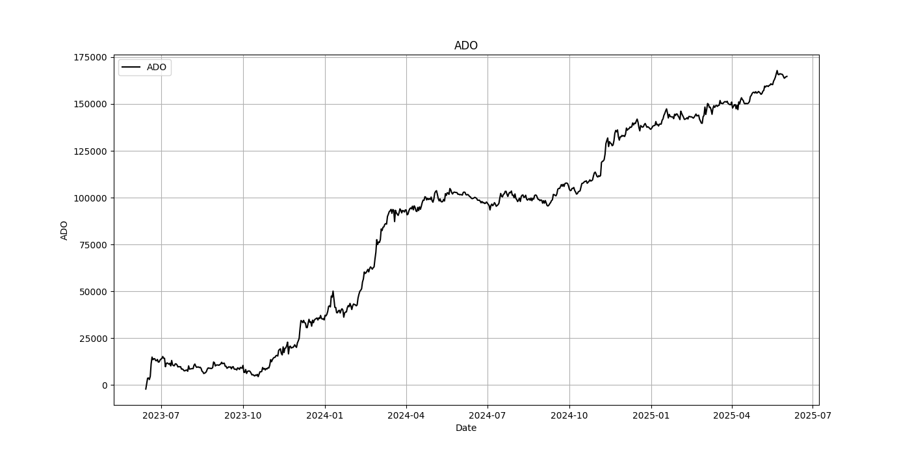
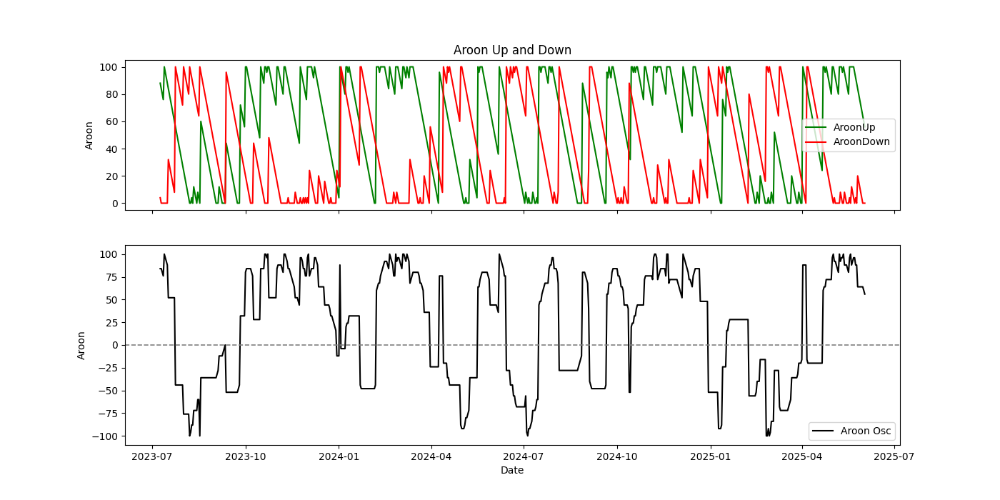
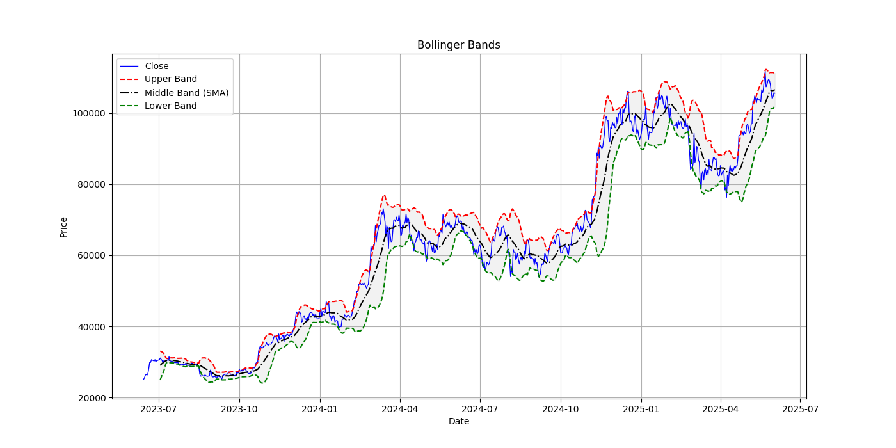
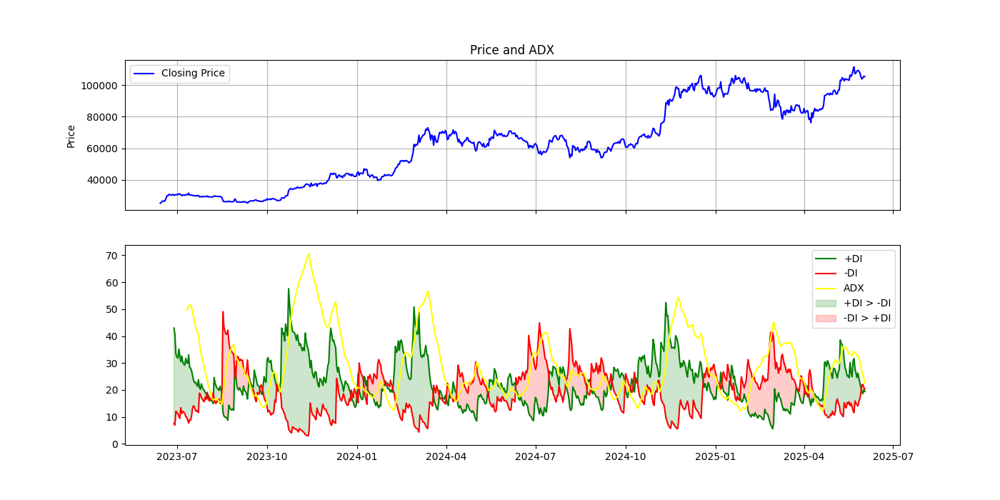
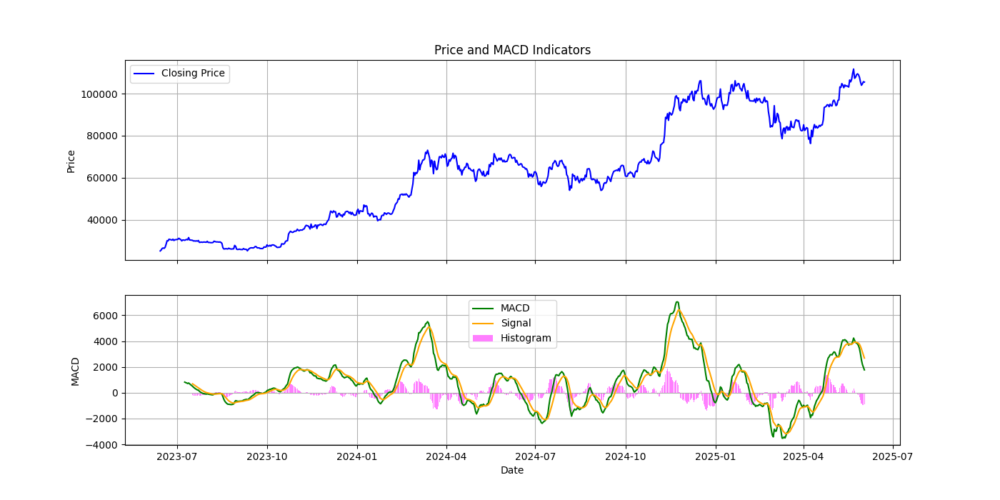
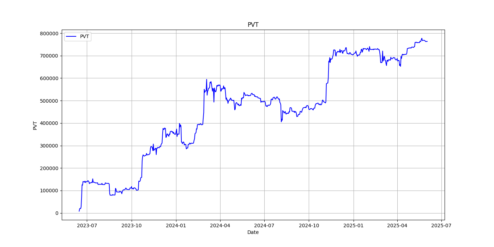
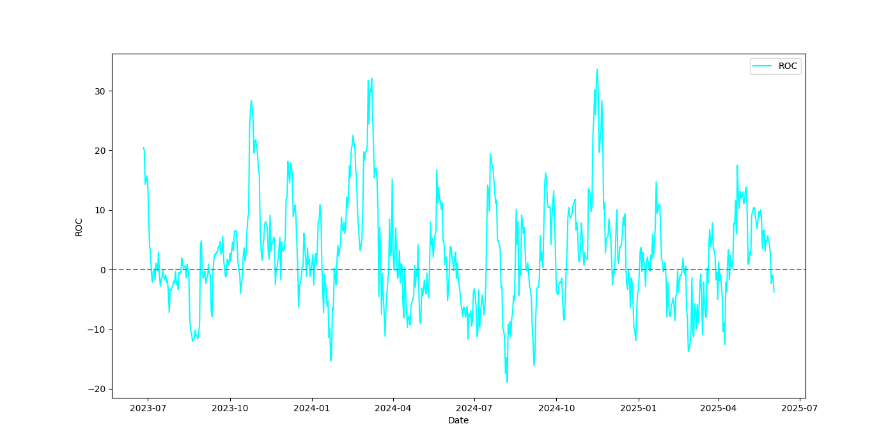
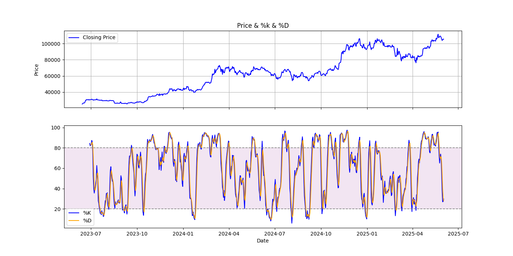
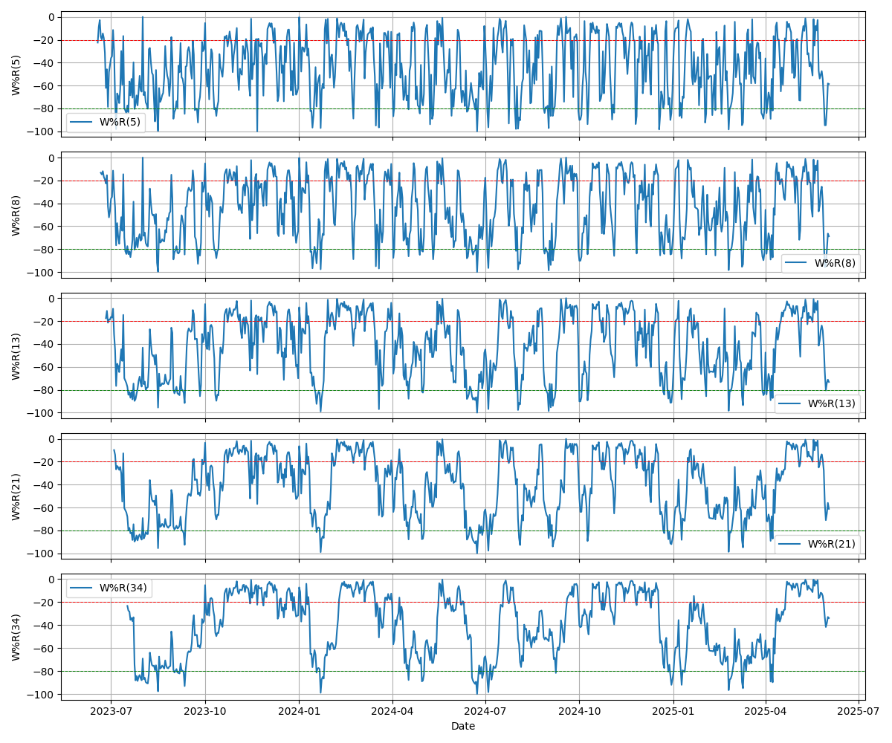

# Crypto Indicators
This repository is me teaching myself how to pull crypto data, what technical indicators do, and how to plot them. 

## Functionality
- Connects to Kraken API to retrieve the OHLCV data.
- Using pandas_ta calculate 24 different indicators.
- Use matplotlib to plot.

## Technical Indicators
| #  | Indicator           | #  | Indicator            |
|----|---------------------|----|----------------------|
| 1  | DIF                 | 13 | W%R(13)              |
| 2  | MACD(9)             | 14 | W%R(21)              |
| 3  | +DI(14)             | 15 | W%R(34)              |
| 4  | -DI(14)             | 16 | %K                   |
| 5  | ADX(14)             | 17 | %D                   |
| 6  | ATR(14)             | 18 | AroonUp              |
| 7  | ADO                 | 19 | AroonDown            |
| 8  | PVT                 | 20 | AroonOSC             |
| 9  | ROC(12)             | 21 | BollingerUp(20)      |
| 10 | CCI(24)             | 22 | BollingerDown(20)    |
| 11 | W%R(5)              | 23 | %b                   |
| 12 | W%R(8)              | 24 | BW                   |

## The Graphs

.png)

